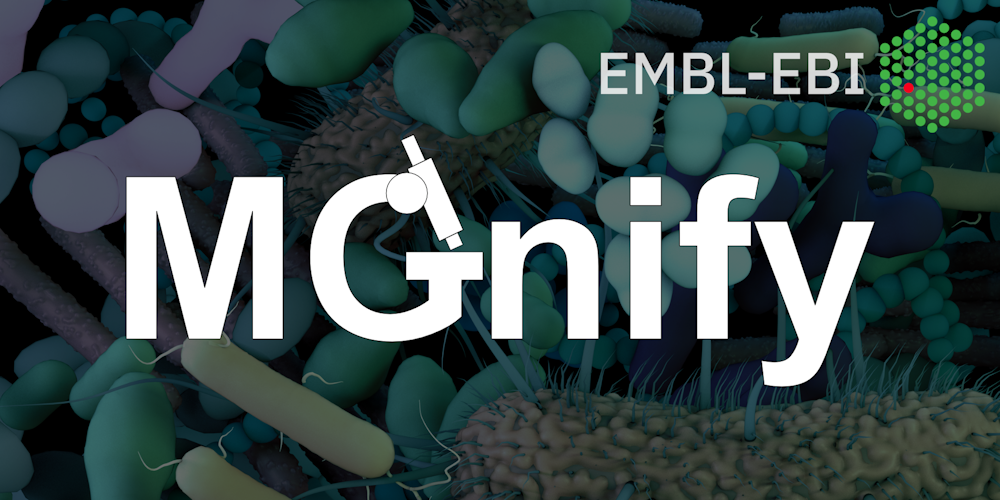

# Workshop Program 

The GSC23 Bangkok meeting will be followed by two concurrent industry led workshops.
Registration for the workshops are independent of the conference registration, but is primarily aimed at conference attendees. Each workshop will last a full day, and be co-located with the main conference in the SiMR building. 

**MGnify workshop venue:** 1st floor, SiMR building (same room as the conference room)
**Nanopore workshop venue:** room 304-305, 3rd floor, SiMR building

The registration costs for each workshop will be 200USD per person to cover the tutors expenses, venue hire, food and sundries. As they are being run at the same time, participants may only register for one of the workshops. 

Each workshop is expected to run from 9am to 5pm with morning and afternoon coffee breaks, and a lunch break where food will be provided. Due to the hands-on nature of these training workshops the number of participants will be restricted to a maximum of 30 people to ensure that everyone receives adequate tutelage. Please ensure you meet the relevant prerequisites for the course before signing up. 

## Workshop1: MGNify:
The EMBL-EBI metagenomics analysis portal. 
Trainers: Rob Finn, Lorna Richardson, Tanya Gurbich (EMBL-EBI,UK) 

## Workshop2: Oxford Nanopore Sequencing Training. 
Trainers: Scott Tighe,Tip Wongsurawant and Nanopore Staff.

#  Nanopore Workshop Program  

Location:Room 304-305, SiMR Building, Siriraj Hospital Mahidol University, 2 Thanon Wang Lang, Siriraj, Bangkok Noi, Bangkok 10700, Thailand

[Oxford Nanopore Technologies Limited](https://nanoporetech.com/) is a UK-based company which develops and sells nanopore sequencing products (including the portable DNA sequencer, MinION) for the direct, electronic analysis of single molecules.

This hands-on workshop will provide attendees with a critical understanding of Oxford Nanopore sequencing technology through a comprehensive laboratory and analysis workflow approach. The workshop will provide a background understanding of the sequencing technology, QC, and sequencer set up with laboratory training including “hands-on“ individually generated sequence ready barcoded libraries, loading flow cells, and operating the MinKNOW sequencing software. Basic data analysis with EPI2ME software will allow participants to analyze and view the results. The program will consist of a morning session where participants will prepare actual sequencing libraries, load the MK1C MinION flow cell and initiate sequencing. An afternoon session will include understanding the QC outputs and Introduction to basecalling and Epi2ME analysis workflows.

Prerequisites include basic laboratory safety procedures, low volume pipette operations, and basic understanding of DNA sequencing.

**Topics covered:**

- Introduction and Overview of Technology
- Library Synthesis and Quality Control
- Loading the Nanopore Flow Cell
- Operating MinKNOW Software
- Sequence Operations of MK1C
- Sequence Monitoring Metrics
- Post Sequencing Data Analysis

#  MGnify Workshop Program 

Location: 1st Floor, SiMR Building, Siriraj Hospital Mahidol University, 2 Thanon Wang Lang, Siriraj, Bangkok Noi, Bangkok 10700, Thailand

[MGnify](https://www.ebi.ac.uk/metagenomics&amp) is a freely available resource, provided by EMBL-EBI, for the analysis and archiving of microbiome-derived sequencing data. Users can request assembly of raw-read data, and taxonomic and functional analysis of publicly available (or pre-publication) datasets available in ENA. MGnify also provides microbiome-derived genome catalogues for multiple biomes, and a non-redundant protein database of over 3 billion sequences.

Two half-day workshops (a mixture of hands-on practicals and lectures) are available on Friday 11th August, provided by the MGnify resource. In the morning there will be an introductory session for users new to the field and/or the resource, and in the afternoon a more advanced session. More details are provided below about what will be covered in each session. Registration will be for both sessions, but delegates should specify which sessions they will attend - either one or both of the sessions, as they prefer based on their experience.

Please note that attendees will be expected to bring along their own laptop computer for use within the practical sessions. All practical aspects will be browser-based and so the only software required for the course will be access to a recent version of either Chrome, Firefox, or Safari.

### Introductory session (9:00-12:00)

**Topics covered:**

- What is MGnify?
- Analysis and results of metabarcoding and metagenomic/metatranscriptic datasets
- Assembly of metagenomic data - the advantages and disadvantages
- Submitting data to ENA for analysis by MGnify
- MGnify quality control and data cleaning steps
- Why metadata is important
- Searching MGnify and accessing results

### Advanced session (14:00-17:00)

**Topics covered:**

- Generating MAGs from metagenomic data
- Biome-specific genome catalogues
- Comparing new MAGs against genome catalogues
- Programmatic access to MGnify
- Downstream analysis in Jupyter notebooks, e.g. comparing across datasets

